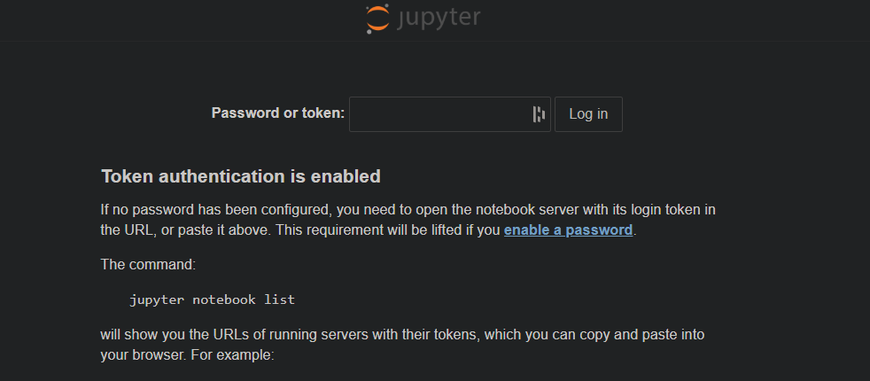
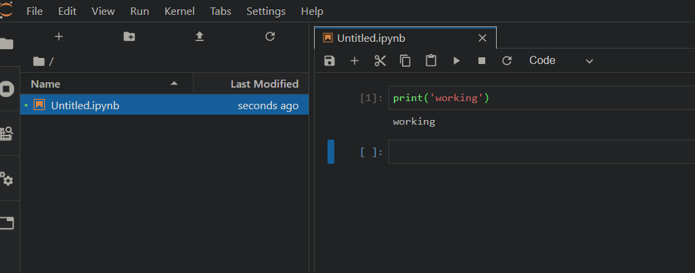

# Deploy and run a Jupyter Lab server using Docker on AWS  

## Do you know Jupyter?  
Jupyter is a collection of open-source web based tools which allow you to create and maintain documents which can contain live code, code outputs, visualizations etc. This provides you a simple interface to quickly run live code and document the outputs all in a single page.These documents containing code and their outputs are called Jupyter notebooks.  

Jupyterlab is one of the tools in Project Jupyter. It is a next gen interactive development environment for Jupyter notebooks. It provides you with an IDE like environment to run and document code outputs, document visualizations etc. This is a great tool to learn machine-learning and develop on it.

## Introduction  
Normally we are used to running Jupyter notebooks or Jupyter lab on our local machines.But many times we have a need to run the same on a server so we can access it from other systems too. This removes the dependency on your local system and you can continue your development from anywhere.  

In this post I will walk through a process to deploy a Jupyter Lab server to AWS using Docker.This method is in no way suitable for a Production environment. This is supposed to cater your personal need to work on a Jupyterlab environment online. To enable it for multiple user access, there are other settings involved which are not discussed on this post.  

I have made all the necessary files available in the below Github repo:  
https://github.com/amlana21/jupyterlab-server-publish  

## What you need  
Below are the pre-requisites for this process and to successfully run the environment on server:  
  - AWS Account  
  - Docker  
  - Below are used in the Docker container to run Jupyterlab:  
    - Nginx  
    - Python  
    - Jupyter

Throughout the rest of post, I will walk throigh how these components work together to provide the final functioning Jupyterlab environment.  

## High Level Architecture  
Below is a high level infrastructure architecture which will be deployed on AWS using Cloudformation. The docker services will be deployed on the EC2 instance using the docker compose file.  

  

Below picture shows how the Docker services orchestrated using the docker compose file. The flow of a request from user to the running Jupyterlab service is shown too. In following sections I will be describing the docker services in detail.  

 


## About the Docker Services  
There are two services which are in play here. These two services are defined in the docker compose file. Below is a brief description of each service:  

  - <em>nginxservice:</em> This will act as a reverse proxy and a load balancer to route the incoming connections to the instance. Since we are using only one instance, we wont need much of the load balancing here.A custom config file has been created for this to forward specific notebook connections to the Jupyter lab service/container.To use the custom config file, a Dockerfile has been created to customize the Nginx image. I have provided the Dockerfile in the repo and the docker compose file includes a build step to build the image on the fly. If needed this can be pre built and pushed to Dockerhub. Then that image can be used in the docker compose file.  

  - <em>jupyterbook:</em> This is the actual Jupyter Lab service which will run the Jupyter notebooks.This is also customized using a custom config file. The custom config file is to specify some custom settings and a login token.I have included a Dockerfile for a customized image of the Jupyter Lab service. The custom image is based on Ubuntu and it installs Python, Jupyter on ubuntu then starts the Jupyter lab service.There is a build step in the docker compose file which builds the image and launches the container from it. This can also be pushed to Docker Hub and the image can be used in the compose file.There is also a volume defined in the compose file. This volume is to keep the Jupyter notebook data consistent across service or container restarts due to various reasons.  

  - <em>jupyternet:</em> This is the network which will handle the intra container communications. This also gets created along with the other services. Both of the services are launched with this network setting.

## Launch Walkthrough  
Next we will walk through the steps to launch the instance and deploy the docker services on it.  

  ### Launch Infrastructure  
  We will launch the infrastructure and the instance needed for this using Cloudformation. I have included the cloudformation template in the Github repo. That can be used to launch the whole infrastructure quickly.Below are high level steps to use the template and create the infra:  
   1. Login to AWS account  
   2. Create a new Key pair if there is no existing Key pair on the account
   3. Navigate to the Cloudformation service page
   4. Click on the button to create a new stack and select the Template file downloaded from the Github repo  
   5. Follow the screens and select respective settings  
   6. Launch the stack and wait for it to complete  
   7. Note the public IP or domain of the instance  
  
  ### Prepare the Instance  
  To prepare the instance so that the services can be launched, docker and docker-compose need to be installed on the instance.Please follow the steps in the official docker documentation to install the same.  
  https://docs.docker.com/install/linux/docker-ce/ubuntu/  
  https://docs.docker.com/compose/install/
  

  ### Deploy the docker services  
  Once the instance is ready, next step is to launch the services and start up the Juperlab server. Follow the below commands on the instance to launch and start the docker services:  
    - <em>Clone the repo: </em>Clone my github repo to get all the necessary files for the docker service.  
    ``` git clone <repo_url>  ```  
    - <em>Navigate to the repo folder</em>  
    ``` cd <folder_name>```  
    - <em>Launch the services: </em>Run the command to launch the docker services defined in the compose file.  
    ``` docker-compose up -d ```  
    This will take some time to launch all the services.Once done it will return to the prompt.  
    - <em>Check the services: </em>Run the below command to check if service is up successfully. Since we are using a single instance, we will see the containers running and not an actual service.  
    ``` docker container ls ```  
    If all the containers listed, show an up status, then the launch was successful.  

  
  ### Verify the application  
  Next we will verify if the application was launched successfully. To launch the Jupyter lab on browser, navigate to this URL:  
  ``` <server_url>:80 ```  
  This will open the below page. Provide the token from the notebook config file as password on this page.  
   


  Once logged in, you will be in the Jupyter lab environment from where new notebook can be launched or other normal Jupyterlab features can be used.  

   

  <em>Note</em>: If afer logging in, page doesnt load, refresh the page and it should open the Jupyter lab application.  

## Conclusion  
In this post, I walked thorugh a process to deploy a Jupyter lab server using Docker. Hope this helps some of you to spin up their own Jupyter lab instances to learn or for some other use of Jupyter notebooks. This is a very straight forward way to launch a basic Jupyter lab server. For more customized settings and more control over the environment, the jupyter config file can be customized with more settings. Last but not the least, this method is not suitbale for production and it only works for one user. For Production use or for multi user use, there will be changes needed to the notebook config file and some other settings in the docker services. For production use, deploying a docker stack will be preferred than docker compose.  
For any further questions or any issues, please reach out to me at amlanc@achakladar.com.

